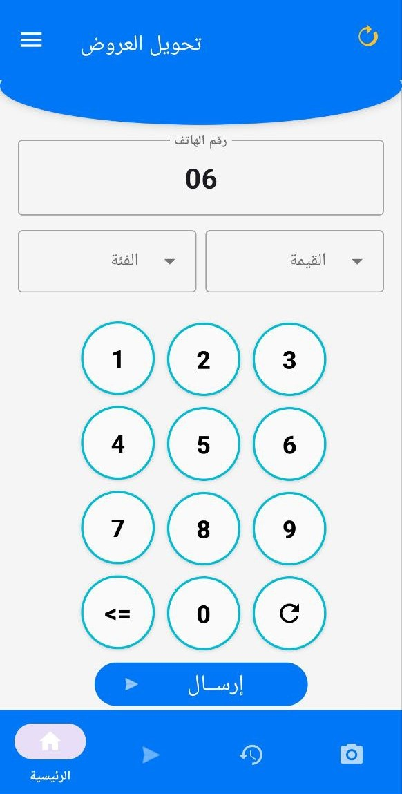
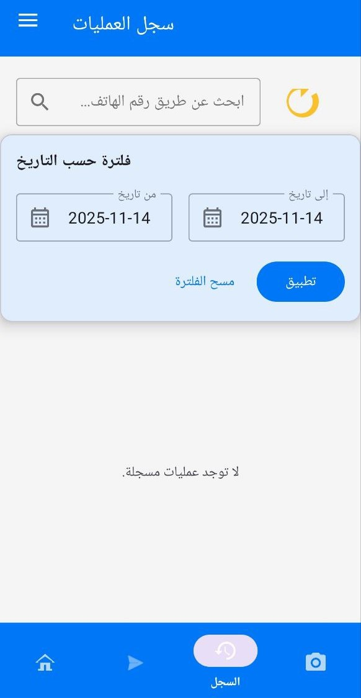
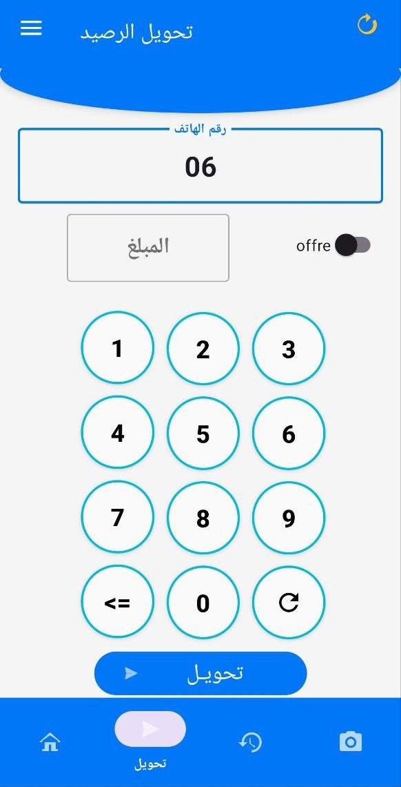

  

<h1 align="center">Sahal pro</h1>

  ودّع أكواد USSD المعقدة!
   
  الأداة الاحترافية الأولى في الجزائر لأتمتة خدمات الفليكسي، تحويل الرصيد، والتعبئة بواجهة رسومية بسيطة وآمنة.

  

## 📸 لقطات من التطبيق

  
  &nbsp;&nbsp;&nbsp;
  
  &nbsp;&nbsp;&nbsp;
  

## ✨ الميزات الرئيسية

* **أتمتة الفليكسي (Sama/Pixx):** إرسال عروض الفليكسي (Sama Net, Mix, Talk) أو عروض Pixx بلمسة واحدة. لا حاجة لحفظ الأكواد، فقط اختر العرض وأدخل الرقم.
* **ماسح بطاقات التعبئة:** استخدم الكاميرا لتعبئة الرصيد (`*111#`) آلياً. التطبيق يقرأ الكود المكون من 15 رقمًا ويرسله بدلاً عنك.
* **إدارة تحويل الرصيد (P2P) (نسخة PRO):** واجهة احترافية لإدارة وتحويل الرصيد (Arsselli) أو العروض. اختر من قائمة أرصدتك (GTS, POSTE...) وأرسل بأمان.
* **سجل عمليات ذكي:** تتبع جميع عملياتك الناجحة (بالأخضر) والفاشلة (بالأحمر) مع رسالة الخطأ من الشبكة.
* **دعم الشرائح المزدوجة (Dual SIM):** خصص شريحة للفليكسي (Sama) وشريحة أخرى لتحويل الرصيد (Arsselli) من الإعدادات.
* **إدارة الأرصدة:** استعلم عن رصيدك الأساسي (`*222#`) أو رصيدك المفصل (P2P عبر SMS) بضغطة زر، وسيتم عرضها وحفظها.

## 🛡️ الخصوصية والصلاحيات

يتطلب Sahal pro استخدام **"خدمة الوصول" (Accessibility Service)** لغرض واحد فقط: **قراءة نوافذ أوامر USSD والرد عليها آلياً** لإتمام العمليات. 

التطبيق **لا يجمع ولا يسجل** أي بيانات شخصية أو كلمات سر. جميع عملياتك تبقى سرية على جهازك.

## 📞 الدعم الفني

للتواصل والدعم أو لطلبات التفعيل (PRO):
* **الهاتف:** `+213 7 75 07 27 90`
